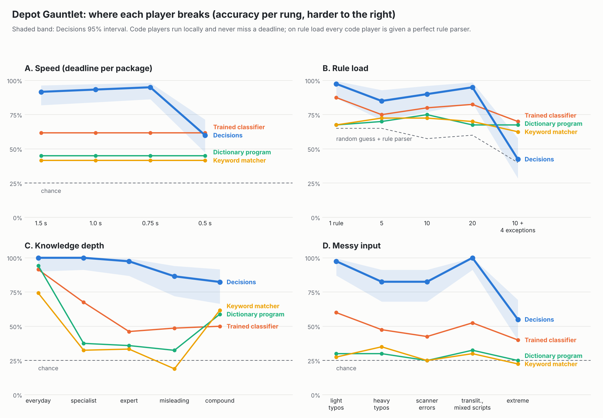

# Depot Gauntlet: where OpenAI Decisions breaks, October 7, 2026

Sorting Depot showed Decisions sorting unseen package labels far better than frozen programs. The Gauntlet pushes
each part of that skill until it fails: four ladders of five (or four) rungs, each harder than the last.
Model `gpt-6-luna`, one request per package unless stated. Tables are recomputed with
`python -m defuse.gauntlet report`; logs are in `evidence/gauntlet-live-2026-10-07.tar.gz`.

## How it was kept fair

1. **Baselines frozen first** (commit `3aab57d`), before any new item existed:
   - the two Sorting Depot programs (keyword matcher, the critical review's dictionary program), unchanged;
   - a **trained classifier**: a multilingual sentence-embedding model (paraphrase-multilingual-MiniLM-L12-v2)
     plus logistic regression, trained on the 288 labels of the development bank only (5-fold cross-validation on
     that bank: 84%). It never saw a test item;
   - on the rule ladder, every program gets the same **perfect rule parser**, written against the exact rule
     templates. Its only possible errors are about what is inside a package.
2. **New items written blind** by a separate agent that could not read the code, baselines or earlier results:
   200 knowledge items (40 per rung, 10 per bin) and 40 transliterated or mixed-script labels.
3. **Labelled blind** by a second agent: it agreed on all 240 bins. 15 items were left out: 5 that repeated an
   earlier bank's label, and 10 it was only moderately sure of (`defuse/gauntlet/bank/excluded.json`).
4. Ladders A, B and the noisy rungs of D reuse the separately written v2 test bank. Noise is generated by code
   from a fixed seed; because no person checked that those labels are still readable, a separate agent decoded
   them blind with no time limit as a reference (below).

## Results (accuracy; Decisions 95% interval in brackets)

### A. Speed: how short can the deadline get? (60 packages per rung)

| Deadline per package | 1.5 s | 1.0 s | 0.75 s | 0.5 s |
|---|---:|---:|---:|---:|
| **Decisions** | **92%** [82-96] | **93%** [84-97] | **95%** [86-98] | **60%** [47-71] |
| missed the deadline | 4 | 2 | 3 | 22 |
| correct when it answered | 98% | 97% | 100% | 95% |
| Trained classifier | 62% | 62% | 62% | 62% |
| Dictionary program | 45% | 45% | 45% | 45% |
| Keyword matcher | 42% | 42% | 42% | 42% |

Median response time was 0.49 s throughout, so at a 0.5 s deadline about a third of answers arrive late. The
answers that do arrive are still right. **The speed limit is the network round trip, not the reasoning.**

### A. Throughput: many packages in one request (the same 200 packages each time)

| Packages per request | Requests | Correct | Seconds per request | Packages per second | Input tokens per package |
|---:|---:|---:|---:|---:|---:|
| 1 | 200 | 97% | 0.49 | 1.7 | 258 |
| 10 | 20 | 92%* | 0.50 | 12 | 140 |
| 50 | 4 | 98% | 0.59 | 77 | 138 |
| 200 | 1 | 97% | 1.14 | **165** | 136 |

\* One of the 20 requests failed with a server error (HTTP 504), so 10 packages got no answer; the other 190 were
97% correct. One single-package request also failed with a 504.

Putting 200 packages in one request (the API's maximum) sorted them in 1.14 s, **about 100 times the throughput**
of one-at-a-time requests, with no loss of accuracy and about half the tokens per package. That one request cost
about $0.003. The trained classifier, run locally, was faster still (0.4 s for all 200) but 64% correct.

### B. Rule load: how many rules can it hold? (40 packages per rung, half going to a listed city)

| Rules in the prompt | 1 | 5 | 10 | 20 | 10 + 4 exceptions |
|---|---:|---:|---:|---:|---:|
| **Decisions** | **98%** | **85%** | **90%** | **95%** | **42%** [29-58] |
| Trained classifier + perfect rule parser | 88% | 75% | 80% | 82% | 70% |
| Dictionary program + perfect rule parser | 68% | 70% | 75% | 68% | 68% |
| Keyword matcher + perfect rule parser | 68% | 72% | 72% | 70% | 62% |
| Random guess + perfect rule parser | 65% | 65% | 57% | 60% | 40% |

Twenty plain destination rules ("Send packages addressed to Madrid to Cold") were no problem. **Four exceptions
broke it.** An exception reads like "packages that would go to Hazardous by their contents and are going anywhere
in Africa or Oceania go to Everything else instead", and rules apply in a stated order: exceptions, then the
destination list, then contents. On the top rung Decisions got 6 of 21 exception-decided packages and 5 of 13
destination-decided packages right. It mostly answered by contents, ignoring the exception. When the contents were
dangerous it also overrode the destination rule (a tear-gas canister for Porto went to Hazardous although Porto's
rule says Fragile), the same pattern seen in Sorting Depot's manifest round. A program with a rule parser is
better here: this is bookkeeping, and code does bookkeeping perfectly.

**Post-hoc check:** rewriting the order as explicit steps ("Step 1: find the bin by contents. Step 2: if that bin
and region match an exception, use it; stop…") did not help: 16/40 against 17/40. This failure is not a wording
problem.

### C. Knowledge depth: how obscure can the item be? (34-40 items per rung)

| Rung | everyday | specialist | expert | misleading | compound |
|---|---:|---:|---:|---:|---:|
| **Decisions** | **100%** | **100%** | **97%** | **86%** | **82%** |
| Trained classifier | 91% | 68% | 46% | 49% | 50% |
| Dictionary program | 94% | 38% | 36% | 32% | 59% |
| Keyword matcher | 74% | 32% | 33% | 19% | 62% |

Examples: specialist is "UN1072 medical cylinder", "quartz cuvettes, 10 mm path"; expert is "t-BuLi, 1.7 M in
pentane", "Zerodur mirror blank", "bafun uni trays, Hokkaido". **Knowledge is not where it breaks:** 78 of 79
specialist and expert items were right; the miss was an antique Crookes tube (an evacuated glass tube) sent to
Hazardous. The trained classifier falls to 46-68% on the same items.

It breaks on **traps**. Misleading labels: "dynamite rolls, sushi platter" (Hazardous at 100% confidence),
"gunpowder green tea", "battery-farm chicken breasts", "tub of lithium grease", "bent-tube neon sign". Compound
items: cold food in glass or ceramic sent to Hazardous instead of Cold (insulin in glass vials, caviar in a crystal
bowl, basil pesto in glass jars). **Ten of its twelve mistakes on this ladder chose Hazardous.** When unsure, it
leans toward the safe-sounding bin.

**Post-hoc check:** writing the precedence as steps ("2: Otherwise, is it food or medicine that must be kept cold
(even if its container is breakable)? Then Cold") raised compound from 28/34 to 33/34. Misleading did not move
(32/37 to 31/37). The precedence errors were partly the instruction's wording; the word traps were not.

### D. Messy input: how damaged can the label be? (40 per rung)

| Rung | light typos | heavy typos | scanner errors | transliteration, mixed scripts | extreme |
|---|---:|---:|---:|---:|---:|
| **Decisions** | **98%** | **82%** | **82%** | **100%** | **55%** [40-69] |
| Trained classifier | 60% | 48% | 42% | 52% | 40% |
| Dictionary program | 30% | 30% | 25% | 32% | 25% |
| Keyword matcher | 28% | 35% | 25% | 30% | 22% |
| Reference reader (no time limit) | 40/40 | 40/40 | 40/40 | n/a | 39/40 |

Examples: heavy typos "crsal cny dh" (crystal candy dish); scanner errors "gsls coookop pel"; extreme
"TR4Y 0F $CO URCHLN RO…" (tray of sea urchin roe, upper case, leetspeak, OCR errors and cut off). Transliterated
labels such as "svezhaya govyadina, 5 kg" (Russian for fresh beef) and "pēnwù shāchóngjì, 24 guàn" (Chinese pinyin
for insecticide spray) were 40/40.

The reference reader was a larger AI agent decoding each label by reading, with no time limit (not a human). It
recovered 159 of 160, so the damaged labels were still readable. Decisions got 22 of the 39 readable extreme labels.
**Heavy damage to Latin-script spelling is where its reading breaks**, while other languages and scripts were no
trouble. When it cannot read a label it falls back to "Everything else" (21 of 33 mistakes on this ladder).

## What this shows

| Pushed on | Holds up to | Breaks at |
|---|---|---|
| Speed | a 0.75 s deadline (95%), and 200 packages in 1.1 s in one request | 0.5 s, the network round trip |
| Rules | 20 destination rules | stacked exceptions with an order of precedence (42%, below the programs) |
| Knowledge | expert chemistry, UN numbers, regional food (78/79) | labels built to mislead (86%) and two-bin precedence (82%; 97% with step-by-step wording) |
| Messy input | any language or script tried, light typos | heavy Latin-script damage (55% where a careful reader got 98%) |

Decisions is a strong, fast reader with broad knowledge: on every knowledge and reading rung it beat a trained
multilingual classifier, often by 30-50 points. It is not a rule engine. Stacked conditional rules are where a
plain program with a parser wins. The practical design follows: code holds the rules, Decisions reads the label,
and many labels go in one request.

## Limits

- One pass per task. Decisions is deterministic for identical prompts, but option order changes with the seed, and
  these results do not measure run-to-run variation. Rungs have 34-60 items, so intervals are wide (shown above).
- Items were written and labelled by AI agents, not validated by people or native speakers. The reference reader is
  an AI, not a human ceiling.
- The rule parser was written knowing the exact rule templates. That makes it a best case for code, not a test of
  parsing free text.
- The post-hoc wording checks were run after seeing the failures and are reported separately. They are not part
  of the pre-set comparison.
- Code players' speed is local CPU time; Decisions' includes the network. Throughput is sequential requests from
  one machine; parallel requests were not tested.

## Cost

1,161 requests. $0.041 from returned usage; $0.073 counted conservatively (35 requests that timed out are counted
at their full reservation). Project total so far: about $0.36 of the $4 cap.
